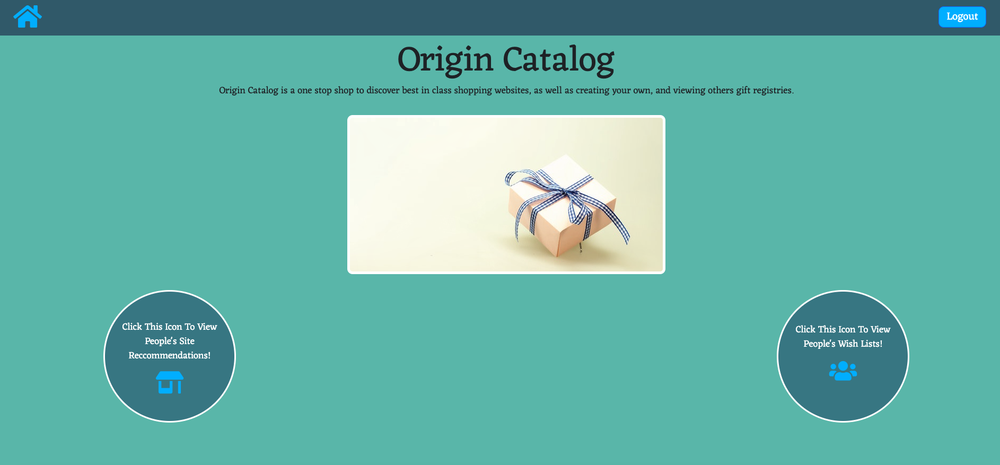

# Origin Catalog

## What is Origin Catalog?
Origin Catalog is my take on an all-in-one shopping site library and gift registry. Users are able to sign in with Google and begin adding gifts to their profile. If they aren't quite sure what they are looking for, they can check out the list of websites that other users have added. 

## Getting Started
Check out Origin Catalog [here](https://origin-catalog.herokuapp.com/)

View my Trello Board [here](https://trello.com/b/8mtsUnWi/unit-2-project)

## Screenshots

## Technologies Used
The technologies I used to create this project are:

* MongoDB
* Mongoose
* Express
* Node.js
* Google OAuth 2.0
* Passport
* JavaScript
* CSS
* HTML
  
## Icebox
Here are someone of the things I would like to implement in the future:

1. I would like to add some sort of image of the gifts and sites
2. Mobile responsiveness
3. Light/Dark mode
4. Add links that take you back a page when looking at a gift/site rather than having to go back to the home page